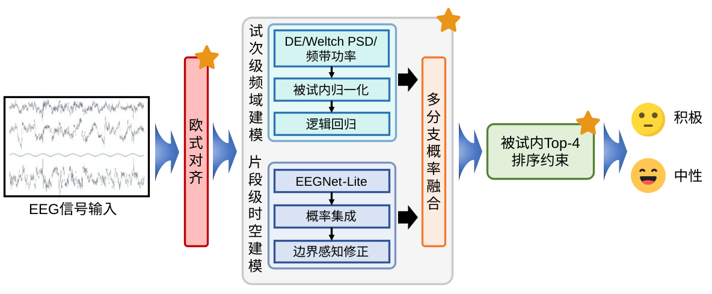
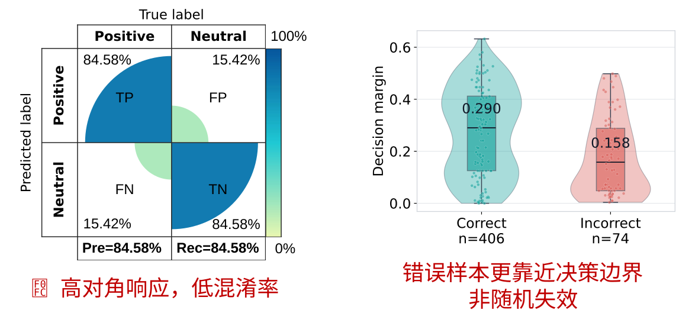
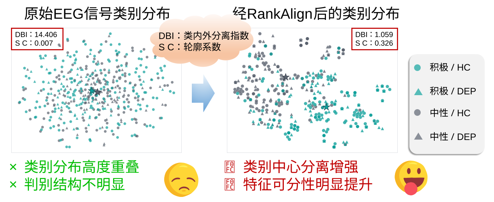

# RankAlign-EEG

[English](README.md) | [简体中文](README_CN.md)

**RankAlign-EEG：基于被试内排序约束与跨被试对齐的多粒度脑电情绪识别方法**官方实现。

## 项目介绍

脑电（EEG）情绪识别面临信号噪声强、标注样本少和被试间生理分布差异显著等问题。在已知被试上训练的模型容易学习个体特征，面对从未参与训练的新被试时，泛化性能可能明显下降。

本项目参加了**第十一届全国大学生生物医学工程创新设计竞赛**，并获得了**一等奖**。赛题面向包含健康人群（HC）和抑郁症人群（DEP）的脑电情绪二分类任务，目标是判断 EEG 试次对应的是**中性情绪**还是**积极情绪**。赛题采用跨被试测试设置，即测试被试不会参与模型训练。

赛题协议还提供了一项公开的结构先验：每名测试被试包含 8 个试次，其中积极与中性各 4 个，但排列顺序未知。RankAlign-EEG 在推理阶段利用这一公开约束，不对所有被试统一使用全局概率阈值，而是在每名被试内部对 8 个积极类概率进行排序，将概率最高的 4 个试次判定为积极。

RankAlign-EEG 针对以下三个实际问题进行设计：

1. **跨被试分布偏移：**使用欧式对齐（EA）[1] 降低被试间协方差差异。
2. **EEG 噪声与小样本问题：**通过多粒度建模融合 EEGNet 风格编码器 [2]、微分熵（DE）[3] 和 Welch 频谱统计 [4]。
3. **被试间概率尺度不一致：**使用被试内 Top-4 排序替代可能产生偏差的全局阈值。

## 数据集

EEG 信号包含 30 个通道，采样率为 250 Hz，因此一个 10 秒片段的形状为 `30 × 2500`。

### 训练集

- 共 60 名被试，包括 40 名健康被试和 20 名抑郁症被试。
- 每名被试包含 40 个 10 秒 EEG segment。
- 每名被试包含 20 个中性片段和 20 个积极片段。
- Segment 级样本总数为 2400。
- 同一情绪下每 5 个连续 segment 构成一个训练 trial，因此每名被试形成 8 个 trial，试次级样本总数为 480。

### 测试集

- 每名测试被试包含 8 个 10 秒 trial。
- 公开赛题协议规定每名被试有 4 个积极 trial 和 4 个中性 trial，但顺序未知。
- 公开测试集和私有测试集标签均不参与模型训练或融合权重拟合。

本仓库不重新分发比赛数据。请按以下目录准备数据：

```text
DATA_ROOT/
|-- train/
|   |-- HC/*timedata.mat
|   `-- DEP/*timedata.mat
`-- test/                   # 仅复现本地 OOF 时可省略
    `-- P_test*.mat
```

每个训练 MAT 文件需包含 `EEG_data_neu` 和 `EEG_data_pos`。信号可以采用通道优先或通道在后的格式，但必须包含 30 个 EEG 通道。

## 方法

RankAlign-EEG 的总体架构如下图所示。



*图 1：RankAlign-EEG 融合跨被试对齐、Segment 级深度表征、Trial 级频域建模、概率融合和被试内 Top-4 推理。*

```text
30 通道原始 EEG
  |
  |-- Segment 级深度分支
  |     |-- 被试级欧式对齐 [1]
  |     |-- EEGNetLite 时空编码器 [2]
  |     |-- 多折 / 多随机种子概率集成
  |     `-- 边界感知概率修正
  |
  |-- Trial 级频域分支 A
  |     |-- DE [3] + Welch 绝对/相对频带功率 [4]
  |     |-- 5 个 segment 均值聚合
  |     |-- 被试内 min-max 归一化
  |     `-- Logistic Regression，C=0.05
  |
  |-- Trial 级频域分支 B
  |     |-- DE [3] + Welch 绝对/相对频带功率 [4]
  |     |-- 5 个 segment 均值聚合
  |     |-- 被试内 z-score 归一化
  |     `-- Logistic Regression，C=0.03
  |
  `-- 固定权重概率融合
        `-- 被试内 Top-4 排序 -> 最终标签
```

### 欧式对齐

对于被试 \(s\)，首先估计平均协方差矩阵：

$$
R_s=\frac{1}{n_s}\sum_{i:s_i=s}\operatorname{cov}(X_i),
$$

随后对每个试次进行白化：

$$
\widetilde X_i=R_s^{-1/2}X_i.
$$

该变换由 He 和 Wu 提出 [1]，不使用情绪标签，属于无监督预处理。

### 多粒度建模

Segment 分支使用紧凑的 EEGNet 风格网络 [2] 从 `1 × 30 × 2500` 的 EEG 张量中学习时间节律和跨通道空间模式。Trial 分支提取 SEED 风格的微分熵 [3] 以及 Welch 绝对和相对频带功率 [4]。训练阶段对同一 trial 的 5 个连续 segment 特征取均值，以获得更加稳定的试次表征。

### 概率融合

本地报告结果使用的固定融合公式为：

$$
p_{final}=0.600p_{segment}+0.305p_{minmax}+0.095p_{zscore}.
$$

融合权重在按被试隔离的 OOF 验证后固定。融合使用原始概率，不使用秩归一化概率。

### 被试内 Top-4 推理

对于每名测试被试，将 8 个融合后的积极类概率按降序排列。前 4 个试次预测为积极，其余 4 个预测为中性：

$$
\hat y_{s,j}=\mathbb{1}\left[\operatorname{rank}_s(p_{s,j})\leq4\right].
$$

Top-4 来自公开赛题协议，是推理约束而非 ranking loss，也不使用隐藏的测试标签。

## 实验结果

### 本地跨被试验证

本地结果全部基于按被试划分的 GroupKFold OOF 预测。同一折中，不会有任何被试同时出现在训练集和验证集中。

| 方法 | Accuracy (%) | AUC (%) |
|---|---:|---:|
| DE + SVM [3] | 79.17 | 84.51 |
| GDDN [5] | 70.50 | 74.21 |
| DeepConvNet [6] | 70.25 | 71.91 |
| TCN [7] | 69.92 | 71.24 |
| EEGConformer [8] | 69.25 | 72.28 |
| CADA [9] | 71.50 | 74.92 |
| MV-SSTMA-DA [10] | 84.17 | 88.72 |
| **RankAlign-EEG** | **84.58** | **89.76** |

为与比赛展示表保持一致，上表沿用“Accuracy”列名。更严格地说，本地 84.58% 是**被试内排序平衡准确率（Rank-BAcc）**，并非使用全局 0.5 阈值得到的普通 Accuracy。表中数值全部来自本项目统一协议下的本地实验；文献编号用于标明方法来源，而不是数值来源。部分近期域适应方法采用本地复现或受原方法启发的代理实现，因此不能理解为直接摘录自原论文的结果。

### 官方测试结果

| 评测数据 | 指标 | 结果 |
|---|---|---:|
| 本地按被试隔离 OOF | Rank-BAcc | **84.58%** |
| 本地按被试隔离 OOF | AUC | **89.76%** |
| 官方公开测试集 | Accuracy | **75.0%** |
| 官方私有测试集 | Accuracy | **82.5%** |

### 错误分析

下图展示了混淆情况以及正确、错误试次的决策间隔。错误主要集中在被试内 Top-4 排序边界附近，说明模型的主要困难来自边界样本的判别模糊，而不是无规律的随机失效。



*图 2：RankAlign-EEG 错误样本与决策边界分析。*

### 表征可视化分析

下图使用 t-SNE [11] 对比 RankAlign-EEG 处理前后的试次级特征分布，并使用 Davies–Bouldin Index（DBI）[12] 和 Silhouette Coefficient（SC）[13] 作为描述性聚类质量指标。经过对齐与多分支融合后，同类样本的分布更加紧凑，积极与中性试次之间的区分更加清晰，并同时展示了 HC 与 DEP 人群的分布情况。



*图 3：RankAlign-EEG 处理前后的试次级特征分布可视化。*

## 环境安装

```bash
python -m venv .venv
.venv/Scripts/activate
pip install -r requirements.txt
```

## 结果复现

生成两个频域 OOF 分支：

```bash
python source/train_spectral.py --data-root DATA_ROOT --output-dir outputs/spectral
```

生成 segment 级 OOF 后，计算固定融合结果：

```bash
python source/fuse_evaluate.py \
  --data-root DATA_ROOT \
  --segment-oof outputs/segment_oof.csv \
  --minmax-oof outputs/spectral/minmax_oof.csv \
  --zscore-oof outputs/spectral/zscore_oof.csv \
  --output outputs/rankalign_oof.csv
```

运行轻量测试：

```bash
set PYTHONPATH=source
python -m unittest discover -s source/tests
```

## 仓库结构

```text
RankAlign/
|-- README.md
|-- README_EN.md
|-- README_CN.md
|-- requirements.txt
|-- configs/rankalign.json
|-- figures/
|   |-- framework.svg
|   |-- error_analysis.svg
|   `-- visualization_analysis.svg
`-- source/
    |-- rankalign/
    |-- train_spectral.py
    |-- fuse_evaluate.py
    `-- tests/
```

## 参考文献

1. H. He and D. Wu, “Transfer Learning for Brain–Computer Interfaces: A Euclidean Space Data Alignment Approach,” *IEEE Transactions on Biomedical Engineering*, 67(2):399–410, 2020. [doi:10.1109/TBME.2019.2913914](https://doi.org/10.1109/TBME.2019.2913914)
2. V. J. Lawhern, A. J. Solon, N. R. Waytowich, S. M. Gordon, C. P. Hung, and B. J. Lance, “EEGNet: A Compact Convolutional Neural Network for EEG-Based Brain–Computer Interfaces,” *Journal of Neural Engineering*, 15(5):056013, 2018. [doi:10.1088/1741-2552/aace8c](https://doi.org/10.1088/1741-2552/aace8c)
3. W.-L. Zheng and B.-L. Lu, “Investigating Critical Frequency Bands and Channels for EEG-Based Emotion Recognition with Deep Neural Networks,” *IEEE Transactions on Autonomous Mental Development*, 7(3):162–175, 2015. [doi:10.1109/TAMD.2015.2431497](https://doi.org/10.1109/TAMD.2015.2431497)
4. P. D. Welch, “The Use of Fast Fourier Transform for the Estimation of Power Spectra,” *IEEE Transactions on Audio and Electroacoustics*, 15(2):70–73, 1967. [doi:10.1109/TAU.1967.1161901](https://doi.org/10.1109/TAU.1967.1161901)
5. B. Chen et al., “GDDN: Graph Domain Disentanglement Network for Generalizable EEG Emotion Recognition,” *IEEE Transactions on Affective Computing*, 2024. [doi:10.1109/TAFFC.2024.3371540](https://doi.org/10.1109/TAFFC.2024.3371540)
6. R. T. Schirrmeister et al., “Deep Learning with Convolutional Neural Networks for EEG Decoding and Visualization,” *Human Brain Mapping*, 38(11):5391–5420, 2017. [doi:10.1002/hbm.23730](https://doi.org/10.1002/hbm.23730)
7. T. M. Ingolfsson et al., “EEG-TCNet: An Accurate Temporal Convolutional Network for Embedded Motor-Imagery Brain–Machine Interfaces,” in *2020 IEEE International Conference on Systems, Man, and Cybernetics*, 2020. [doi:10.1109/SMC42975.2020.9283028](https://doi.org/10.1109/SMC42975.2020.9283028)
8. Y. Song, Q. Zheng, B. Liu, and X. Gao, “EEG Conformer: Convolutional Transformer for EEG Decoding and Visualization,” *IEEE Transactions on Neural Systems and Rehabilitation Engineering*, 31:710–719, 2023. [doi:10.1109/TNSRE.2022.3230250](https://doi.org/10.1109/TNSRE.2022.3230250)
9. H. Huang, X. Si, Y. Han, and D. Ming, “A Novel Conditional Adversarial Domain Adaptation Network for EEG Cross-Subject Emotion Recognition,” *IEEE Transactions on Affective Computing*, 16(4):2905–2917, 2025. [doi:10.1109/TAFFC.2025.3588873](https://doi.org/10.1109/TAFFC.2025.3588873)
10. L. Zhang, H. Shi, Z. Li, W.-L. Zheng, and B.-L. Lu, “Multi-View Self-Supervised Domain Adaptation for EEG-Based Emotion Recognition,” *IEEE Transactions on Affective Computing*, 16(4):3055–3066, 2025. [doi:10.1109/TAFFC.2025.3574868](https://doi.org/10.1109/TAFFC.2025.3574868)
11. L. van der Maaten and G. Hinton, “Visualizing Data Using t-SNE,” *Journal of Machine Learning Research*, 9:2579–2605, 2008. [JMLR paper](https://www.jmlr.org/papers/v9/vandermaaten08a.html)
12. D. L. Davies and D. W. Bouldin, “A Cluster Separation Measure,” *IEEE Transactions on Pattern Analysis and Machine Intelligence*, PAMI-1(2):224–227, 1979. [doi:10.1109/TPAMI.1979.4766909](https://doi.org/10.1109/TPAMI.1979.4766909)
13. P. J. Rousseeuw, “Silhouettes: A Graphical Aid to the Interpretation and Validation of Cluster Analysis,” *Journal of Computational and Applied Mathematics*, 20:53–65, 1987. [doi:10.1016/0377-0427(87)90125-7](https://doi.org/10.1016/0377-0427(87)90125-7)

## 开源协议

开源协议尚待确定。除非原始比赛数据的许可条款明确允许，否则请勿重新分发比赛数据。

## 总结

RankAlign-EEG 并非依赖单一的大规模网络，而是通过一条相互配合的处理链解决跨被试 EEG 情绪识别问题：欧式对齐缓解被试间协方差偏移，Segment 与 Trial 两种粒度融合时空和频域互补证据，Top-4 推理则依据公开赛题协议降低被试间概率标定差异。最终方法取得了 84.58% 的本地 Rank-BAcc 和 89.76% 的 AUC，并在官方公开测试集和私有测试集上分别获得 75.0% 和 82.5% 的 Accuracy，验证了跨被试对齐、多粒度证据融合和结构化被试内决策的有效性。

## 📞 联系方式

如果您对本项目有任何问题或建议，欢迎提交 **Issue**！

也欢迎通过邮箱 [hongbinchen@stu.njmu.edu.cn](mailto:hongbinchen@stu.njmu.edu.cn) 与我们联系。
